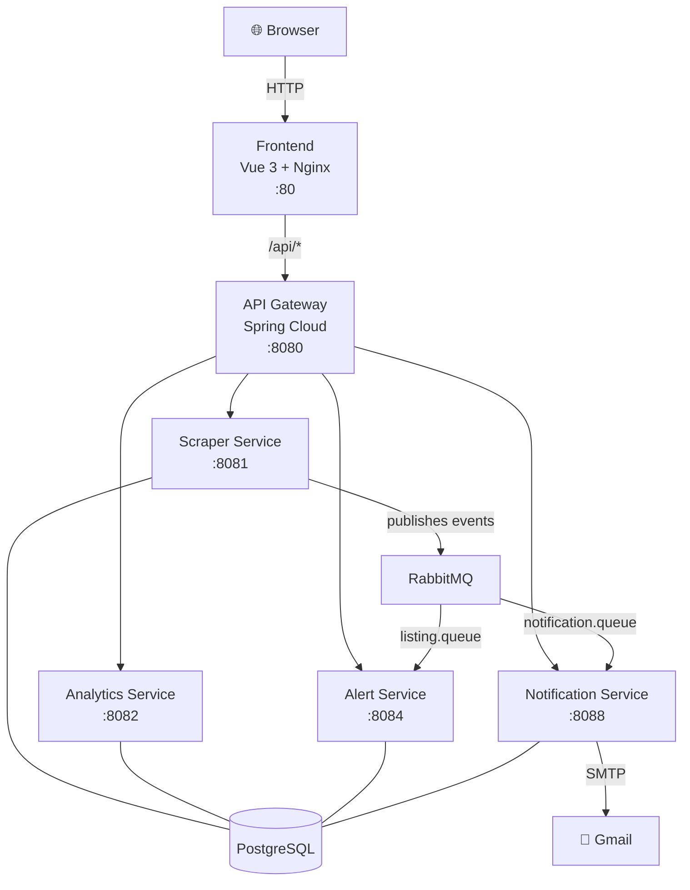
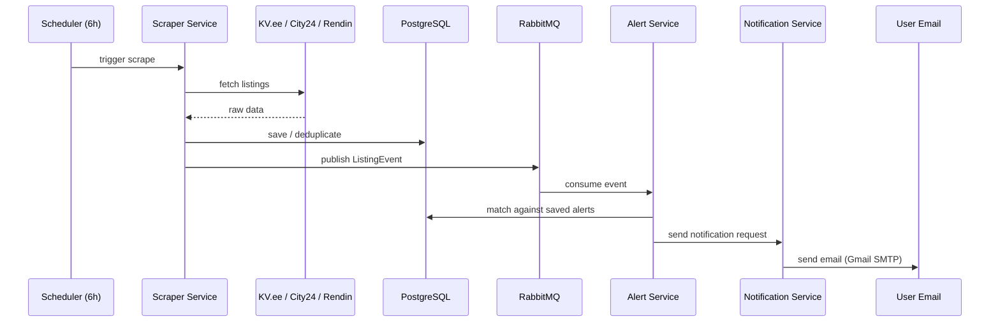

# Üüriturg — Tartu Rental Market Monitor

A real-time rental aggregator for Tartu, Estonia. Automatically scrapes listings from KV.ee, City24, and Rendin, deduplicates them, tracks price trends by neighbourhood, and sends email alerts when a matching listing appears.

**Live:** [uuriturg.cs.ut.ee](http://uuriturg.cs.ut.ee)

---

## Architecture



---

## Data Flow



---

## Features

- Scrapes **KV.ee**, **City24**, and **Rendin** every 6 hours automatically
- Deduplicates listings — same apartment never shows twice
- **Interactive map** of all active listings across Tartu
- **Price trend charts** per neighbourhood over time
- **Email alerts** — set a price/size/neighbourhood filter and get notified instantly
- Admin dashboard with scrape control and system status

---

## Tech Stack

| Layer | Technology |
|---|---|
| Backend | Java 21 + Spring Boot 3.4.5 |
| Database | PostgreSQL 16 |
| Messaging | RabbitMQ 3 (Spring AMQP) |
| API Gateway | Spring Cloud Gateway |
| Frontend | Vue 3 + Vite + Chart.js + Leaflet |
| Scraping | Java HttpClient + Jsoup |
| Email | Gmail SMTP (production) |
| Containers | Docker + Docker Compose |

---

## Scrapers

| Source | Method |
|---|---|
| KV.ee | HTML scraping via `wget` subprocess (bypasses Cloudflare) + Jsoup parsing |
| City24 | Public REST JSON API — `api.city24.ee/et_EE/search/realties` |
| Rendin | Firebase callable cloud function — POST to `cloudfunctions.net` |

---

## Services

| Service | Port | Role |
|---|---|---|
| api-gateway | 8080 | Routes all frontend requests |
| scraper-service | 8081 | Scrapes listings, stores, publishes events |
| analytics-service | 8082 | Price trends, neighbourhood stats |
| alert-service | 8084 | Manages alert rules, matches listings |
| notification-service | 8088 | Sends emails via SMTP |

---

## Running Locally

**Prerequisites:** Docker + Docker Compose

```bash
git clone https://github.com/hashimminhas/Rental-Market.git
cd Rental-Market
docker compose up -d
```

App available at **http://localhost:3000**  
API Gateway at **http://localhost:8080**

---

## Production Deployment

```bash
echo "MAIL_USERNAME=your@gmail.com" > .env.prod
echo "MAIL_PASSWORD=your-app-password" >> .env.prod
docker compose -f docker-compose.prod.yml --env-file .env.prod up -d --build
```

App runs on port **80**.
